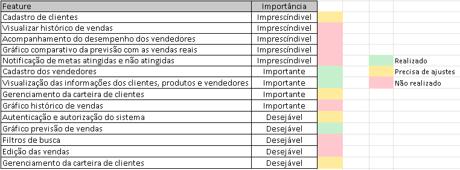
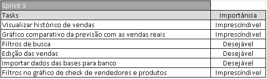
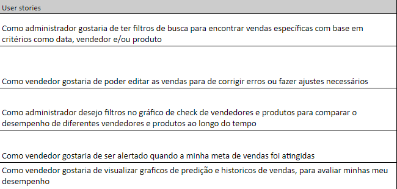
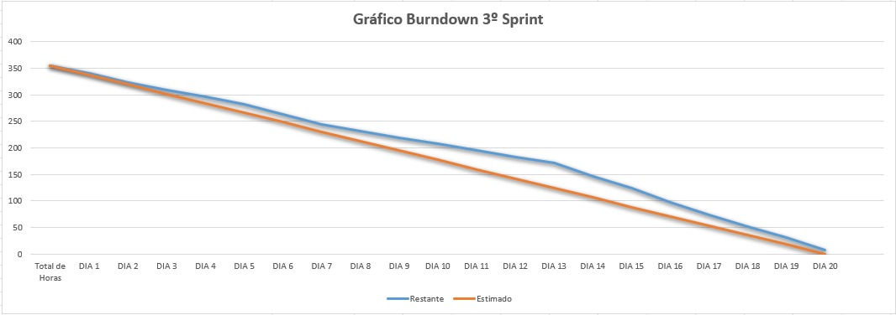
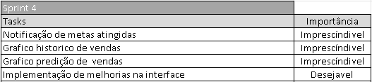

<h1 align="center"></h1>

  

 

<!--badges-->

    
    
    
     
    
    
    
    
     

<!-- -->
 
<h1 align="center">📂 Sobre a Dom Rock </h1>

> _Product Owner_ - [Thiago Chaves]()

> _Scrum Master_ - [Ariane Cristine Alves de Sousa](https://www.linkedin.com/in/ariane-sousa77)

> _Dev. Team_ - [Ludmila Mariana Chagas](https://www.linkedin.com/in/ludmila-mariana-chagas-273548187/)

> _Dev. Team_ - [Elizabeth Cristina Alves Leite](https://www.linkedin.com/in/elizabeth-cristina-alves-leite-176a9416a)

> _Dev. Team_ - [Tobias Fernandes Bezerra Sousa](https://www.linkedin.com/in/tobias-sousa-23bba822a)

> _Dev. Team_ - [Beatrice Lopes Correa]()

> _Dev. Team_ - [Murilo Junior]()

## Empresa parceira

A Dom Rock é uma empresa que oferece soluções utilizando tecnologia de dados para ampliar resultados em marketing, vendas, distribuição, logística, operações, engenharia e finanças.
Utilizando modelos matemáticos e algoritmos baseados em aprendizado de máquina que endereçam duas soluções sendo Nxt.Demand com quatro produtos – Vox, Sales&Distribution, Marketing&Planning, Pricing – e Nxt.Operations com dois produtos – Matching&Risk e Optimization.

<h1 align="center">💻 Nossa proposta </h1>

A Dom Rock recebe a predição de vendas de seus clientes em formato csv tendo que padronizar todos os arquivos antes do uso, sendo assim sentiu necessidade de uma aplicação web que facilitaria a entrada destes dados em um padrão definido diminuindo o tempo gasto com a padronização.  
Nesse semestre o grupo está propondo uma solução para a empresa. O desafio consiste em lidar com o histórico de movimentação de produtos (vendas e estoque), predição de faturamento (feito por um algoritmo de IA já existente) e a entrada de dados oriundas da força de vendas quanto ao planejamento futuro.

<h1 align="center">🗓️ Entregas </h1>

  <table align="center">
    <tr>
    <td><b>Entrega</b></td>
    <td><b>Descrição</b></td>
    <td><b>Data</b></td>
    <td><b>Tag</b></td>
  </tr>

  <tr>
   <td>Primeira Sprint</td>
   <td>Cadastro carteira de clientes, cadastro dos vendedores, visão administrativa dos cadastro de clientes, produtos e vendedor, mecânismo de autenticação e autorização do sistema</td>
   <td>02/04/2023</td>
   <td><a href="https://github.com/Thunder53/Dom-Rock/releases/tag/Sprint01">Sprint01</a></td>
  </tr>

  <tr>
   <td>Segunda Sprint</td>
   <td>Visualização de informações do cliente, sistema de cadastro de novos clientes e seus produtos, gráfico de visualização da quantidade de vendas, realizar gerenciamento da carteira do cliente</td>
   <td>23/04/2023</td>
   <td><a href="https://github.com/Thunder53/Dom-Rock/releases/tag/Sprint02">Sprint02</a></td>
  </tr>

  <tr>
   <td>Terceira Sprint</td>
   <td>Visualização do histórico de vendas, gráficos comparativos, implementação de filtors de busca e edição das vendas, importação das bases de dados para o banco </td>
   <td>14/05/2023</td>
   <td><a href="">Sprint03</a></td>
  </tr>
 
   <tr>
   <td>Quarta Sprint</td>
   <td>Implementação de notificações no sistema quando metas são atingidas pelos vendedores, gráficos histórico e predição de vendas, melhorias na interface</td>
   <td>13/06/2023</td>
   <td><a href="">Sprint04</a></td>
  </tr>
  </table>

<h1 align="center">📋 Documentação da Sprint 3</h1>

  <h2 align="center">Product Backlog</h2>
    

  <h2 align="center">Backlog</h2>
  <h3 align="center">Tasks</h3>
    

  <h2 align="center">User Stories</h2>
    

  <h1 align="center">📉 Burndown</h1>
       

  
  <h1 align="center"> Backlog Sprint 4</h1>
        

  
  <h3 align="center">
    <a href="doc/Diagramas">• Diagramas 
    <a href="https://trello.com/b/JinZ6ETv/thunder">• Cards (Trello)
    <a href="doc/README.md">• Documentação Completa
  </h3>

 

    <h1 align="left">👩‍💻 Equipe</h1>
        • <a href="https://www.linkedin.com/in/thiago-lopes-chaves-5ba22b209">Thiago Chaves </a>(<i>Product Owner</i>) 
        • <a href="https://www.linkedin.com/in/bewtrice/">Beatrice Lopes </a>(<i>Scrum Master</i>) 
        • <a href="https://www.linkedin.com/in/ariane-sousa77">Ariane Cristine Alves de Sousa </a>(<i>Dev Team</i>) 
        • <a href="https://www.linkedin.com/in/elizabeth-cristina-alves-leite-176a9416a">Elizabeth Cristina Alves Leite </a>(<i>Dev Team</i>) 
        • <a href="https://www.linkedin.com/in/ludmila-mariana-chagas-273548187/">Ludmila Mariana Chagas </a>(<i>Dev Team</i>) 
        • <a href="https://www.linkedin.com/in/murilo-jos%C3%A9-de-brito-junior-32403b157">Murilo Junior </a>(<i>Dev Team</i>) 
        • <a href="https://www.linkedin.com/in/tobias-sousa-23bba822a">Tobias Fernandes Bezerra Sousa </a>(<i>Dev Team</i>) 

