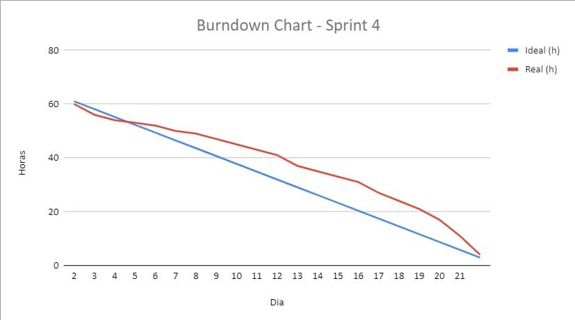

<h1 align="center"></h1>

  

 

<!--badges-->

    
    
    
     
    
    
    
    
     

<!-- -->
 
<h1 align="center">📂 Sobre a Dom Rock </h1>

> _Product Owner_ - [Thiago Chaves](https://www.linkedin.com/in/thiago-lopes-chaves-5ba22b209/)

> _Scrum Master_ - [Ariane Cristine Alves de Sousa](https://www.linkedin.com/in/ariane-sousa77)

> _Dev. Team_ - [Ludmila Mariana Chagas](https://www.linkedin.com/in/ludmila-mariana-chagas-273548187/)

> _Dev. Team_ - [Elizabeth Cristina Alves Leite](https://www.linkedin.com/in/elizabeth-cristina-alves-leite-176a9416a)

> _Dev. Team_ - [Tobias Fernandes Bezerra Sousa](https://www.linkedin.com/in/tobias-sousa-23bba822a)

> _Dev. Team_ - [Beatrice Lopes Correa](https://www.linkedin.com/in/bewtrice)

> _Dev. Team_ - [Murilo Junior](https://www.linkedin.com/in/murilo-jos%C3%A9-de-brito-junior-32403b157/)

## Empresa parceira

A Dom Rock é uma empresa que oferece soluções utilizando tecnologia de dados para ampliar resultados em marketing, vendas, distribuição, logística, operações, engenharia e finanças.
Utilizando modelos matemáticos e algoritmos baseados em aprendizado de máquina que endereçam duas soluções sendo Nxt.Demand com quatro produtos – Vox, Sales&Distribution, Marketing&Planning, Pricing – e Nxt.Operations com dois produtos – Matching&Risk e Optimization.

<h1 align="center">💻 Nossa proposta </h1>

A Dom Rock recebe a predição de vendas de seus clientes em formato csv tendo que padronizar todos os arquivos antes do uso, sendo assim sentiu necessidade de uma aplicação web que facilitaria a entrada destes dados em um padrão definido diminuindo o tempo gasto com a padronização.  
Nesse semestre o grupo está propondo uma solução para a empresa. O desafio consiste em lidar com o histórico de movimentação de produtos (vendas e estoque), predição de faturamento (feito por um algoritmo de IA já existente) e a entrada de dados oriundas da força de vendas quanto ao planejamento futuro.

<h1 align="center">🗓️ Entregas </h1>

  <table align="center">
    <tr>
    <td><b>Entrega</b></td>
    <td><b>Descrição</b></td>
    <td><b>Data</b></td>
    <td><b>Tag</b></td>
  </tr>

  <tr>
   <td>Primeira Sprint</td>
   <td>Cadastro carteira de clientes, cadastro dos vendedores, visão administrativa dos cadastro de clientes, produtos e vendedor, mecânismo de autenticação e autorização do sistema</td>
   <td>02/04/2023</td>
   <td><a href="https://github.com/Thunder53/Dom-Rock/releases/tag/Sprint01">Sprint01</a></td>
  </tr>

  <tr>
   <td>Segunda Sprint</td>
   <td>Visualização de informações do cliente, sistema de cadastro de novos clientes e seus produtos, gráfico de visualização da quantidade de vendas, realizar gerenciamento da carteira do cliente</td>
   <td>23/04/2023</td>
   <td><a href="https://github.com/Thunder53/Dom-Rock/releases/tag/Sprint02">Sprint02</a></td>
  </tr>

  <tr>
   <td>Terceira Sprint</td>
   <td>Visualização do histórico de vendas, gráficos comparativos, implementação de filtors de busca e edição das vendas, importação das bases de dados para o banco </td>
   <td>14/05/2023</td>
   <td><a href="https://github.com/Thunder53/Dom-Rock/releases/tag/Sprint03">Sprint03</a></td>
  </tr>
 
   <tr>
   <td>Quarta Sprint</td>
   <td>Implementação de notificações no sistema quando metas são atingidas pelos vendedores, gráficos histórico e predição de vendas, melhorias na interface</td>
   <td>13/06/2023</td>
   <td><a href="">Sprint04</a></td>
  </tr>
  </table>

<h1 align="center">📋 Documentação da Sprint 4</h1>

<h3 align="center">Backlog</h3>

<table align="center">
<tr>
 <th><b>Backlog</b></th>
<th><b>Importância</b></th>

</tr>

<tr>
<td>Cadastro de clientes</td>
<td>Imprescíndivel</td>
</tr>

<tr>
<td>Visualizar histórico de vendas</td>
<td>Imprescíndivel</td>
</tr>

<tr>
<td>Acompanhamento do desempenho dos vendedores</td>
<td>Imprescíndivel</td>
</tr>

<tr>
<td>Gráfico comparativo da previsão com as vendas reais</td>
<td>Imprescíndivel</td>
</tr>

<tr>
<td>Notificação de metas atingidas e não atingidas</td>
<td>Imprescíndivel</td>
</tr>
  
<tr>
<td>Cadastro dos vendedores</td>
<td>Importante</td>
</tr>
  
<tr>
<td>Visualização das informações dos clientes, produtos e vendedores</td>
<td>Importante</td>
</tr>
  
<tr>
<td>Gerenciamento da carteira de clientes</td>
<td>Importante</td>
</tr>
    
<tr>
<td>Gráfico previsão e histórico de vendas</td>
<td>Importante</td>
</tr>
    
<tr>
<td>Autenticação e autorização do sistema</td>
<td>Desejável</td>
</tr>

<tr>
<td>Filtros no gráfico de check de vendedores e produtos</td>
<td>Desejável</td>
</tr>
  
<tr>
<td>Edição das vendas</td>
<td>Desejável</td>
</tr>
  
<tr>
<td>Gerenciamento da carteira de clientes</td>
<td>Desejável</td>
</tr>
</table>

<h3 align="center">Tasks</h3>

<table align="center">
<tr>
<th><b>Tasks</b></th>
<th><b>Importância</b></th>
</tr>
 
<tr>
<td>Filtros de busca</td>
<td>Desejável</td>
</tr>
  
<tr>
<td>Edição das vendas</td>
<td>Desejável</td>
</tr>
   
<tr>
<td>Filtros no gráfico de check de vendedores e produtos</td>
<td>Imprescíndivel</td>
</tr>
    
<tr>
<td>Notificação de metas atingidas</td>
<td>Imprescíndivel</td>
</tr>
    
<tr>
<td>Grafico historico e predição de vendas</td>
<td>Imprescíndivel</td>
</tr>
      
</table>

<h2 align="center">User Stories</h2>

<table align="center">
<tr>
<th><b>Numeração</b></th>
<th><b>User stories</b></th>
</tr>
     
<tr>
<th>1</th>
<td>Como administrador gostaria de ter filtros de busca para encontrar vendas específicas com base em critérios como data, vendedor e/ou produto</td>
</tr>
     
<tr>
<th>2</th>
<td>Como vendedor gostaria de poder editar as vendas para de corrigir erros ou fazer ajustes necessários</td>
</tr>
       
<tr>
<th>3</th>
<td>Como administrador desejo filtros no gráfico de check de vendedores e produtos para comparar o desempenho de diferentes vendedores e produtos ao longo do tempo</td>
</tr>
        
<tr>
<th>4</th>
<td>Como vendedor gostaria de ser alertado quando a minha meta de vendas foi atingidas</td>
</tr>
        
<tr>
<th>5</th>
<td>Como vendedor gostaria de visualizar graficos de predição e historicos de vendas, para avaliar minhas meu desempenho</td>
</tr>
          
</table>

<h1 align="center"> Critério de Aceite</h1>

<table align="center">
<tr>
<th><b>Numeração</b></th>
<th><b>Critérios de Aceite</b></th>
</tr>
         
<tr>
<th>1</th>
<td>- O sistema deve permitir que o administrador utilize filtros de busca para encontrar vendas específicas;
 - Os filtros devem incluir critérios como data, vendedor e/ou produto;
 - O resultado da busca deve ser preciso e exibir apenas as vendas que correspondam aos critérios selecionado.</td>
</tr>
         
<tr>
<th>2</th>
<td>-Os vendedores devem ter acesso a um sistema ou plataforma que permita a edição das vendas;
     -Após a edição de uma venda, todas as informações atualizadas devem ser refletidas corretamente nos relatórios, registros financeiros e quaisquer outros sistemas relacionados.
     -Os vendedores devem ter permissões adequadas para editar apenas as vendas que realizaram.</td>
</tr>
           
<tr>
<th>3</th>
<td>- gráfico de desempenho de vendedores e produtos deve incluir filtros que permitam ao administrador selecionar vendedores específicos e produtos específicos para visualizar seu desempenho ao longo do tempo.
 -O gráfico deve fornecer uma representação visual clara e comparativa do desempenho de diferentes vendedores e produtos ao longo do tempo. </td>
</tr>
            
<tr>
<th>4</th>
<td>-O sistema deve fornecer um alerta ao vendedor quando sua meta de vendas for atingida.;
     -Isso pode ser feito por meio de uma notificação visual, como um pop-up ou um ícone de destaque na interface do usuário, garantindo que o vendedor seja prontamente informado sobre o alcance da meta.</td>
</tr>
            
<tr>
<th>5</th>
<td>-O sistema deve fornecer gráficos de predição de vendas precisos e confiáveis, permitindo que o vendedor avalie seu desempenho e planeje suas estratégias futuras.</td>
</tr>
              
</table>

  
<h1 align="center">📉 Burndown</h1>

  
  
<h3 align="center">
<a href="doc/Diagramas">• Diagramas 
<a href="https://trello.com/b/JinZ6ETv/thunder">• Cards (Trello)
<a href="doc/README.md">• Documentação Completa
</h3>

 

