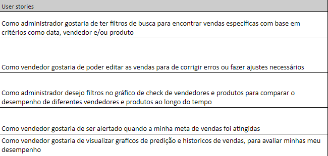

<h1 align="center">📂 Documentação Completa</h1>
    <h2 align="left">Indice</h1>

            1. Backlog
                1.1 Product bakclog
                1.2 Trello Cards and Tasks
                1.3 Jornada do Usuario 
            2. Sprint 1
                2.1 Backlog
                2.2 User Stories
                2.3 Burndown
            3. Sprint 2
                3.1 Backlog
                3.2 User Stories
                3.3 Burndown
            4. Sprint 3
                4.1 Backlog
                4.2 User Stories
                4.3 Burndown
            5. Sprint 4
                5.1 Backlog
                5.2 User Stories
                5.3 Burndown
            6. Diagramas
            7. Wireframes

 
<h1 align="center">Backlog </h1>
    <h2 align="left">1.1 Product Backlog</h2>
    

    <h2 align="left">1.2 Trello Cards e Tasks</h2>
    
Você pode visualizar nosso quadro Trello >> <a href="https://trello.com/b/JinZ6ETv/thunder">aqui</a> <<
    

    <h2 align="left">1.3 Jornada do Usuario</h1>
    

    

<h1 align="center">2.Sprint 1</h1>
    <h2 align="left">2.1 Backlog</h2>
        

    <h2 align="left">2.2 User Stories</h2>
        

    <h2 align="left">2.3 Burndown</h2>
        

<h1 align="center">3.Sprint 2</h1>
        <h2 align="left">3.1 Backlog</h2>
        

    <h2 align="left">3.2 User Stories</h2>
        

    <h2 align="left">3.3 Burndown</h2>
        

<h1 align="center">4.Sprint 3</h1>
        <h2 align="left">4.1 Backlog</h2>
        

    <h2 align="left">4.2 User Stories</h2>
        

    <h2 align="left">4.3 Burndown</h2>
        

<h1 align="center">5.Sprint 4</h1>
        <h2 align="left">5.1 Backlog</h2>
        

    <h2 align="left">5.2 User Stories</h2>
        

<h1 align="center">6.Diagramas</h1>
    <h2 align="left">6.1 Modelo Lógico</h2>
        

    <h2 align="left">6.2 Diagrama Entidade-Relacionamento</h2>
        

<h1 align="center">7.Wireframes</h1>
    <h2 align="left"></h2>
        

    <h2 align="left"></h2>
        

            <h2 align="left"></h2>
        

    <h2 align="left"></h2>
        

            <h2 align="left"></h2>
        

    <h2 align="left"></h2>
        

