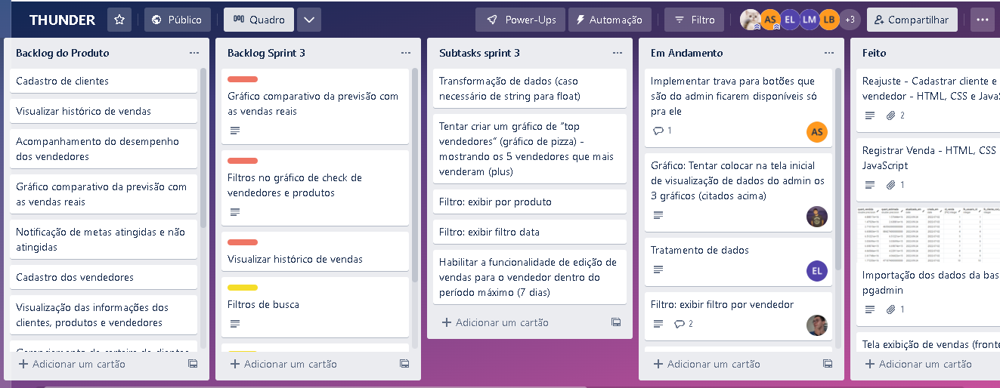
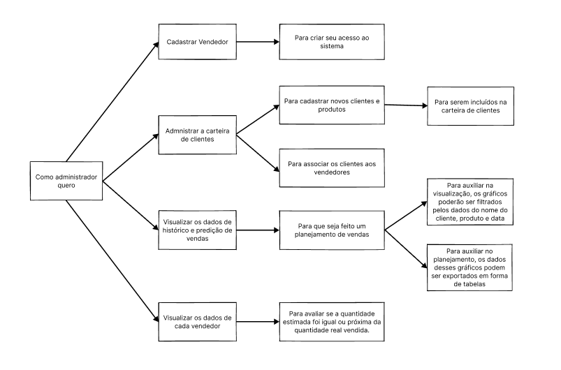
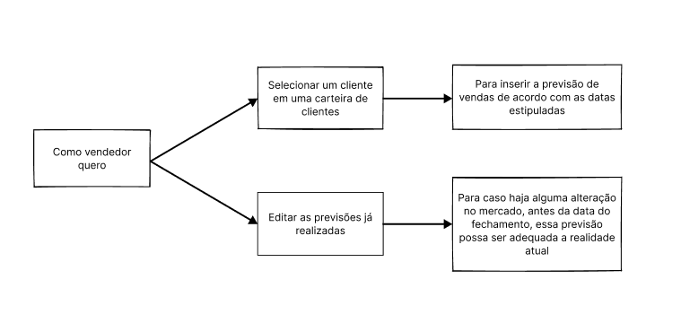
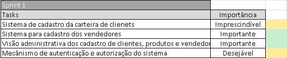
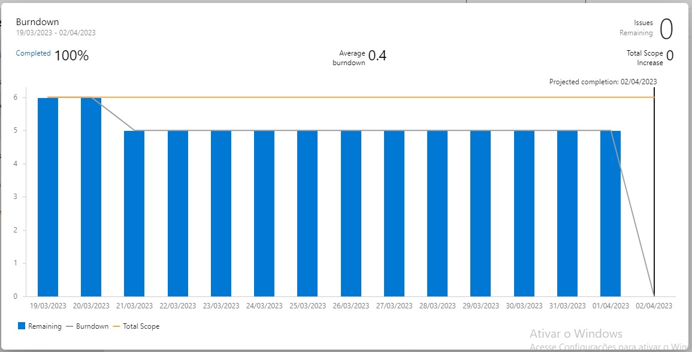
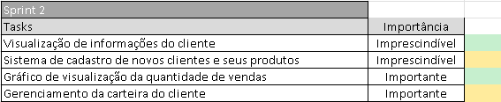
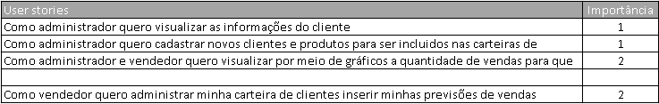
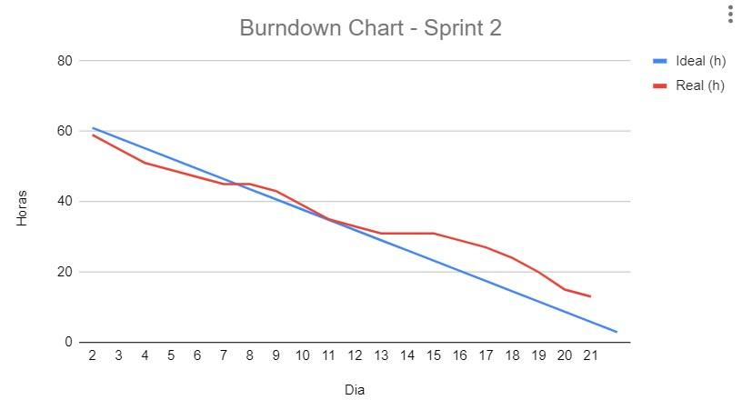
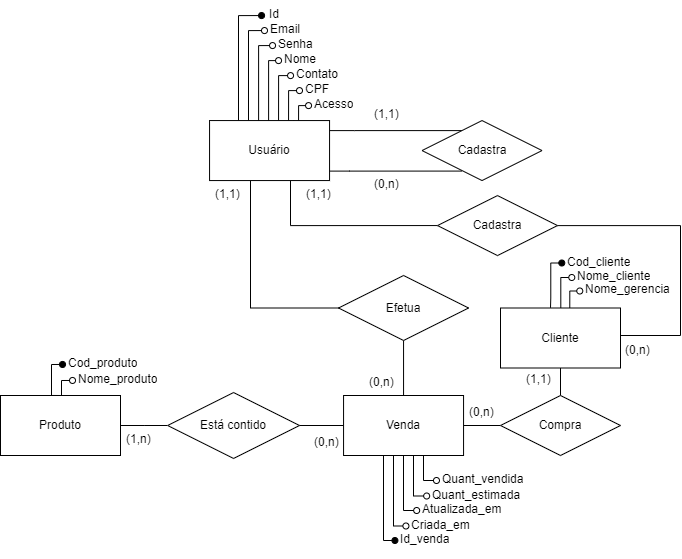

<h1 align="center">📂 Documentação Completa</h1>
    <h2 align="left">Indice</h1>

            1. Backlog
                1.1 Product bakclog
                1.2 Trello Cards and Tasks
                1.3 Jornada do Usuario 
            2. Sprint 1
                2.1 Backlog
                2.2 User Stories
                2.3 Critérios de Aceite
                2.4 Burndown
            3. Sprint 2
                3.1 Backlog
                3.2 User Stories
                3.3 Critérios de Aceite
                3.4 Burndown
            4. Sprint 3
                4.1 Backlog
                4.2 User Stories
                4.3 Critérios de Aceite
                4.4 Burndown
            5. Sprint 4
                5.1 Backlog
                5.2 User Stories
                5.3 Critérios de Aceite
                5.4 Burndown
            6. Diagramas
            7. Wireframes

 
<h1 align="center">Backlog </h1>
    <h2 align="left">1.1 Product Backlog</h2>
    '

<table align="center">
<tr>
<th><b>Backlog</b></th>
<th>Importância</th>

</tr>

<tr>
<td>Cadastro de clientes</td>
<td>Imprescíndivel</td>
</tr>

<tr>
<td>Visualizar histórico de vendas</td>
<td>Imprescíndivel</td>
</tr>

<tr>
<td>Acompanhamento do desempenho dos vendedores</td>
<td>Imprescíndivel</td>
</tr>

<tr>
<td>Gráfico comparativo da previsão com as vendas reais</td>
<td>Imprescíndivel</td>
</tr>

<tr>
<td>Notificação de metas atingidas e não atingidas</td>
<td>Imprescíndivel</td>
</tr>
  
<tr>
<td>Cadastro dos vendedores</td>
<td>Importante</td>
</tr>
  
<tr>
<td>Visualização das informações dos clientes, produtos e vendedores</td>
<td>Importante</td>
</tr>
  
<tr>
<td>Gerenciamento da carteira de clientes</td>
<td>Importante</td>
</tr>
    
<tr>
<td>Gráfico previsão e histórico de vendas</td>
<td>Importante</td>
</tr>
    
<tr>
<td>Autenticação e autorização do sistema</td>
<td>Desejável</td>
</tr>

<tr>
<td>Filtros no gráfico de check de vendedores e produtos</td>
<td>Desejável</td>
</tr>
  
<tr>
<td>Edição das vendas</td>
<td>Desejável</td>
</tr>
  
<tr>
<td>Gerenciamento da carteira de clientes</td>
<td>Desejável</td>
</tr>
</table>

    <h2 align="left">1.2 Trello Cards e Tasks</h2>
    
Você pode visualizar nosso quadro Trello >> <a href="https://trello.com/b/JinZ6ETv/thunder">aqui</a> <<
    

    <h2 align="left">1.3 Jornada do Usuario</h1>
    

    

<h1 align="center">2.Sprint 1</h1>
    <h2 align="left">2.1 Backlog</h2>
        

    <h2 align="left">2.2 User Stories</h2>
        

    <h2 align="left">2.3 Critérios de Aceite</h2>
        

    <h2 align="left">2.4 Burndown</h2>
        

<h1 align="center">3.Sprint 2</h1>
        <h2 align="left">3.1 Backlog</h2>
        

    <h2 align="left">3.2 User Stories</h2>
        

   <h2 align="left">3.3 Critérios de Aceite</h2>
        

    <h2 align="left">3.4 Burndown</h2>
        

<h1 align="center">4.Sprint 3</h1>
        <h2 align="left">4.1 Backlog</h2>
        

    <h2 align="left">4.2 User Stories</h2>
        

    <h2 align="left">4.3 Burndown</h2>
        

<h1 align="center">5.Sprint 4</h1>
        <h2 align="left">5.1 Backlog</h2>
        

<table align="center">
<tr>
<th><b>Tasks</th>
<th>Importância</th>
</tr>
 
<tr>
<td>Filtros de busca</td>
<td>Desejável</td>
</tr>
  
<tr>
<td>Edição das vendas</td>
<td>Desejável</td>
</tr>
   
<tr>
<td>Filtros no gráfico de check de vendedores e produtos</td>
<td>Imprescíndivel</td>
</tr>
    
<tr>
<td>Notificação de metas atingidas</td>
<td>Imprescíndivel</td>
</tr>
    
<tr>
<td>Grafico historico e predição de vendas</td>
<td>Imprescíndivel</td>
</tr>
      
</table>

    <h2 align="left">5.2 User Stories</h2>

<table align="center">
<tr>
<th><b>Numeração</b></th>
<th><b>User stories</b></th>
</tr>
     
<tr>
<th>1</th>
<td>Como administrador gostaria de ter filtros de busca para encontrar vendas específicas com base em critérios como data, vendedor e/ou produto</td>
</tr>
     
<tr>
<th>2</th>
<td>Como vendedor gostaria de poder editar as vendas para de corrigir erros ou fazer ajustes necessários</td>
</tr>
       
<tr>
<th>3</th>
<td>Como administrador desejo filtros no gráfico de check de vendedores e produtos para comparar o desempenho de diferentes vendedores e produtos ao longo do tempo</td>
</tr>
        
<tr>
<th>4</th>
<td>Como vendedor gostaria de ser alertado quando a minha meta de vendas foi atingidas</td>
</tr>
        
<tr>
<th>5</th>
<td>Como vendedor gostaria de visualizar graficos de predição e historicos de vendas, para avaliar minhas meu desempenho</td>
</tr>
          
</table>

    <h2 align="left">5.3 User Stories</h2>
    

<table align="center">
<tr>
<th><b>Numeração</b></th>
<th><b>Critérios de Aceite</b></th>
</tr>
         
<tr>
<th>1</th>
<td>- O sistema deve permitir que o administrador utilize filtros de busca para encontrar vendas específicas;
 - Os filtros devem incluir critérios como data, vendedor e/ou produto;
 - O resultado da busca deve ser preciso e exibir apenas as vendas que correspondam aos critérios selecionado.</td>
</tr>
         
<tr>
<th>2</th>
<td>-Os vendedores devem ter acesso a um sistema ou plataforma que permita a edição das vendas;
     -Após a edição de uma venda, todas as informações atualizadas devem ser refletidas corretamente nos relatórios, registros financeiros e quaisquer outros sistemas relacionados.
     -Os vendedores devem ter permissões adequadas para editar apenas as vendas que realizaram.</td>
</tr>
           
<tr>
<th>3</th>
<td>- gráfico de desempenho de vendedores e produtos deve incluir filtros que permitam ao administrador selecionar vendedores específicos e produtos específicos para visualizar seu desempenho ao longo do tempo.
 -O gráfico deve fornecer uma representação visual clara e comparativa do desempenho de diferentes vendedores e produtos ao longo do tempo. </td>
</tr>
            
<tr>
<th>4</th>
<td>-O sistema deve fornecer um alerta ao vendedor quando sua meta de vendas for atingida.;
     -Isso pode ser feito por meio de uma notificação visual, como um pop-up ou um ícone de destaque na interface do usuário, garantindo que o vendedor seja prontamente informado sobre o alcance da meta.</td>
</tr>
            
<tr>
<th>5</th>
<td>-O sistema deve fornecer gráficos de predição de vendas precisos e confiáveis, permitindo que o vendedor avalie seu desempenho e planeje suas estratégias futuras.</td>
</tr>
              
</table>

    
   <h2 align="left">5.4 Burndown</h2>

<h1 align="center">6.Diagramas</h1>
    <h2 align="left">6.1 Modelo Lógico</h2>
        

    <h2 align="left">6.2 Diagrama Entidade-Relacionamento</h2>
        

<h1 align="center">7.Wireframes</h1>
    <h2 align="left"></h2>
        

    <h2 align="left"></h2>
        

            <h2 align="left"></h2>
        

    <h2 align="left"></h2>
        

            <h2 align="left"></h2>
        

    <h2 align="left"></h2>
        

